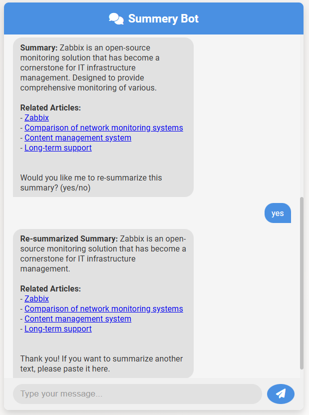

# Summery Bot

**Summery Bot** is an intelligent web-based chatbot designed to help users summarize long texts efficiently. Leveraging advanced natural language processing (NLP) models, Summery Bot not only provides concise summaries of user-provided content but also fetches related Wikipedia articles to offer additional context and information.

## Table of Contents

- [Features](#features)
- [Demo](#demo)
- [Installation](#installation)
- [Usage](#usage)
- [Project Structure](#project-structure)
- [Dependencies](#dependencies)
- [Configuration](#configuration)
- [Deployment](#deployment)
- [License](#license)

## Features

- **Greeting Detection:** Recognizes and responds to user greetings.
- **Text Summarization:** Generates concise summaries of user-provided texts with customizable lengths.
- **Re-summarization:** Offers the option to further condense existing summaries.
- **Related Articles:** Fetches and displays related Wikipedia articles based on the summarized content.
- **Unique Session Management:** Utilizes unique identifiers (`uid`) to manage individual user sessions.
- **Responsive UI:** Features a user-friendly and responsive interface with loading animations during processing.

## Demo




## Installation

### Prerequisites

- **Python 3.7+**
- **pip** (Python package installer)
- **Virtual Environment** (optional but recommended)

### Steps

1. **Clone the Repository**

   ```bash
   git clone https://github.com/KaushalBhatol/summery-bot.git
   cd summery-bot
   ```

2. **Create and Activate a Virtual Environment (Optional)**

    ```bash
    python3 -m venv venv
    source venv/bin/activate  # On Windows: venv\Scripts\activate
    ```

3. **Install Dependencies**

    Ensure pip is up to date:

    ```bash
    pip install --upgrade pip
    ```

    Then, install the required packages:

    ```bash
    pip install -r requirements.txt
    ```

    **Note:** Installing torch with CUDA support requires specific commands based on your system's configuration. If you plan to use GPU acceleration, refer to the official PyTorch installation guide for the appropriate installation command.


## Usage

1. **Run the Application**

    ```bash
    python app.py
    ```

    The application will start and listen on 0.0.0.0 at port 80.


2. **Access the Chatbot Interface**

    Open your web browser and navigate to:

    ```bash
    http://localhost/
    ```

    __Note:__ Depending on your deployment environment, you might need to adjust the URL.

3. **Interact with Summery Bot**

    * Greeting: Start by greeting the bot (e.g., "Hi", "Hello").
    * Summarization:
      * Paste a long text (more than 10 words).
      * Specify the desired summary length in words.
      * Optionally, choose to re-summarize the generated summary.
    * Repeat: You can summarize multiple texts in a single session.

## Project Structure

Structure:

```text
    summery-bot/
    │
    ├── app.py
    ├── bot_logic.py
    ├── requirements.txt
    ├── README.md
    │
    ├── templates/
    │   └── index.html
    │
    └── static/
        ├── css/
        │   └── styles.css
        └── js/
            └── scripts.js
```

* __app.py:__ Flask application that handles routing and session management.
* __bot_logic.py:__ Contains the SummeryBot class responsible for processing user inputs and generating responses.
* __requirements.txt:__ Lists all Python dependencies required for the project.
* __templates/index.html:__ HTML template for the chatbot interface.
* __static/css/styles.css:__ Stylesheet for the chatbot interface.
* __static/js/scripts.js:__ JavaScript file handling frontend interactions and communication with the backend

## Dependencies

The project relies on the following Python packages:

```text
# requirements.txt

Flask==2.3.2
Flask-Session==0.4.0
wikipedia==1.4.0
transformers==4.31.0
torch==2.0.1
```

### Explanation of Dependencies:

1. __Flask (`Flask==2.3.2`):__
   * __Purpose:__ A lightweight WSGI web application framework used to build the chatbot's backend.
2. __Flask-Session (`Flask-Session==0.4.0`):__
   * __Purpose:__ Adds server-side session support to Flask applications, enabling the storage of user-specific data such as unique session identifiers (uid).
3. __Wikipedia (`wikipedia==1.4.0`):__
   * __Purpose:__ A Python library that allows for easy access to Wikipedia's content. It's used to fetch related articles based on the summarized text.
4. __Transformers (`transformers==4.31.0`):__
   * __Purpose:__ Provides state-of-the-art machine learning models for natural language processing tasks. Specifically, it's used here for text summarization using models like facebook/bart-large-cnn.
5. __PyTorch (`torch==2.0.1`):__
   * __Purpose:__ An open-source machine learning library used by the transformers library to perform computations on CPUs and GPUs. It facilitates the efficient running of summarization models.


## Configuration

### Secret Key

The SECRET_KEY in app.py is crucial for securing sessions. Ensure you replace 'thisislongtextkeybykaushal' with a strong, unpredictable secret key.

```python
app.config['SECRET_KEY'] = 'your_strong_secret_key_here'
```

### Port and Host

By default, the application is configured to run on `0.0.0.0` at port `80`. If you need to change these settings, modify the `app.run()` parameters in `app.py`:

```python
if __name__ == "__main__":
    app.run(host='0.0.0.0', port=80, debug=True)
```

## Deployment

### Local Deployment

1. __Start the Application__

```bash
python app.py
```

2. __Access the Chatbot__
    
    Open your browser and navigate to `http://localhost/` or `http://<your-ip-address>/` if accessing from another device on the same network.

### Production Deployment

For deploying Summery Bot in a production environment:
1. __Use a Production-Grade Server__

    Replace Flask's built-in server with a production-ready server like gunicorn or uWSGI.
    
    __Using Gunicorn:__

    ```bash
    pip install gunicorn
    gunicorn -w 4 -b 0.0.0.0:80 app:app
    ```

2. __Set Up a Reverse Proxy__

    Use Nginx or Apache as a reverse proxy to handle client requests and serve static files efficiently.

3. __Enable HTTPS__

    Secure your application by obtaining SSL certificates and configuring HTTPS using tools like Let's Encrypt.

4. __Optimize Performance__

   * Caching: Implement caching strategies for repeated requests to improve response times.
   * Scaling: Consider horizontal scaling strategies if expecting high traffic.

5. __Monitor and Log__

    Implement logging and monitoring to keep track of application performance and troubleshoot issues.

## License

This project is licensed under the MIT License.

__Note:__ Ensure that all files are correctly placed:

* app.py at the root of your project.
* bot_logic.py at the root of your project.
* templates/index.html
* static/css/styles.css
* static/js/scripts.js